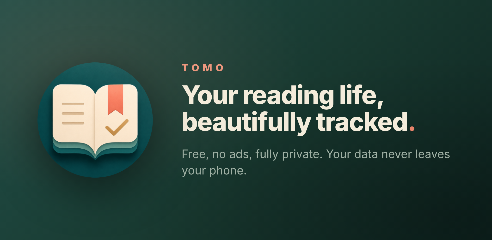
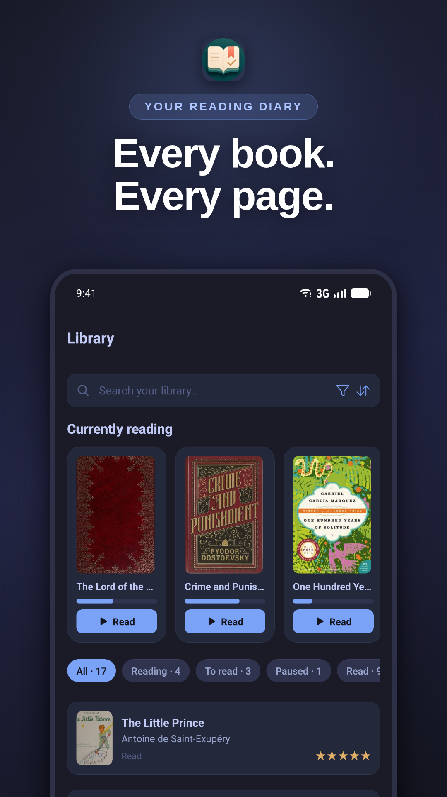
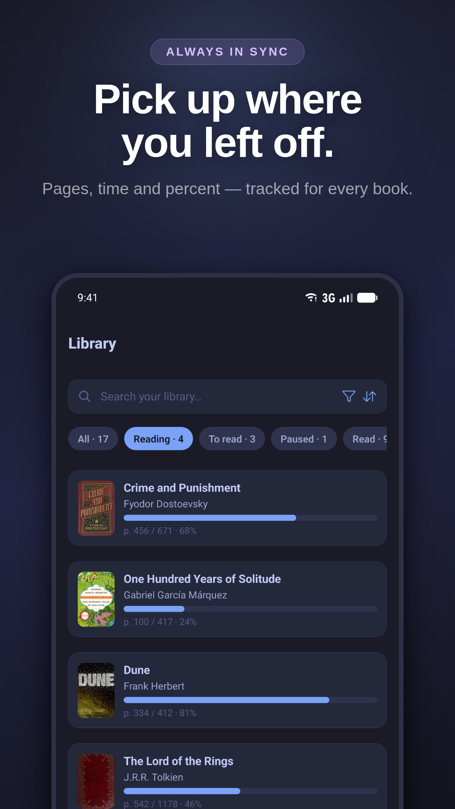
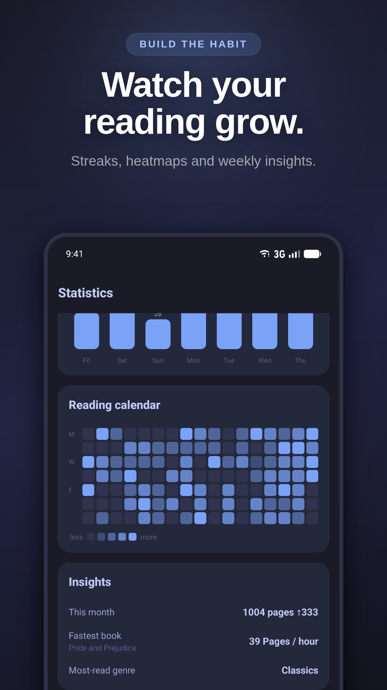
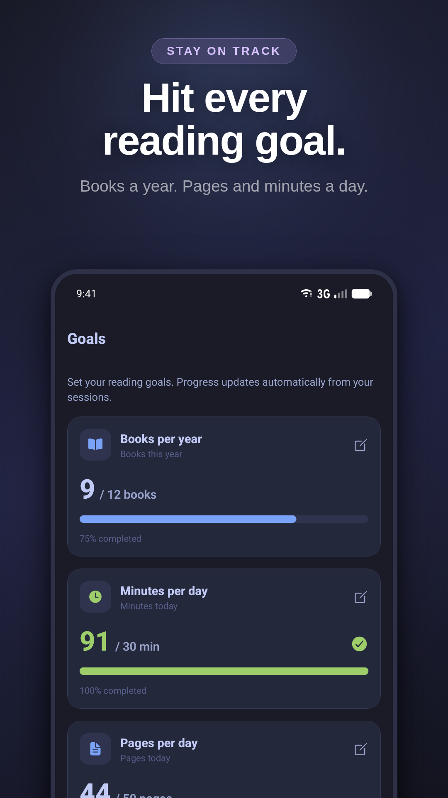
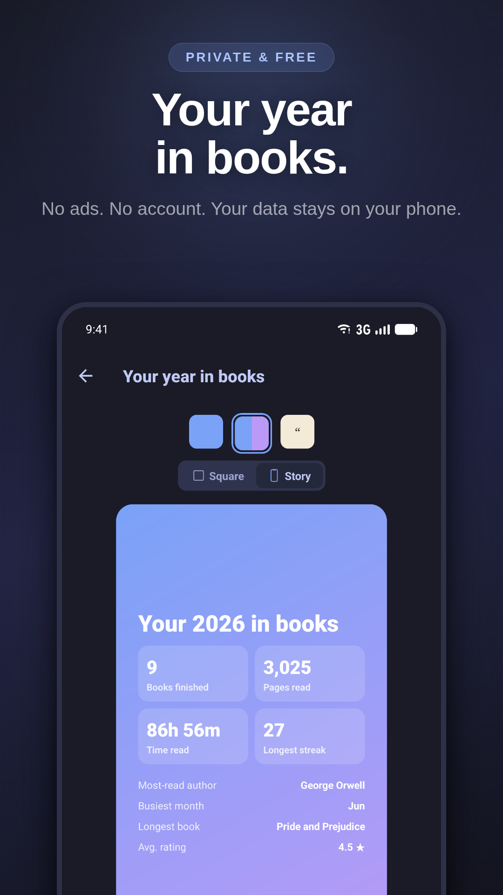

# Tomo

A free, local-first reading tracker for Android, and an open alternative to Bookmory. Keep a library, track reading sessions and progress, set goals, and look at your stats, with everything stored on your device.

It is built with Expo (React Native and TypeScript). Book data comes from Google Books and Open Library, both free and without an API key.



## Screenshots

| Library | Progress | Statistics | Goals | Wrapped |
|---|---|---|---|---|
|  |  |  |  |  |

## Features

- Library organised by status (to read, reading, read, paused, did not finish), with custom colored shelves.
- Add books by searching online (Google Books or Open Library), scanning an ISBN barcode, or entering them by hand with your own cover.
- A reading timer that records how long you read and which pages.
- Per-book progress and a remaining-time estimate, plus reading time, pages, a day streak, a weekly chart, a GitHub-style heatmap, and monthly insights such as fastest book and most-read genre.
- Goals for books per year, minutes per day, and pages per day, updated automatically from your sessions.
- A "year in books" summary you can share as an image.
- Half-star ratings and a personal review per book.
- Notes and quotes saved per book with page numbers, and a quote can be shared as an image.
- Series, mood, and pace fields shown as chips.
- CSV import from Goodreads and StoryGraph, and full JSON backup export and import.
- An optional daily reading reminder.
- Home-screen widgets: currently reading, quick-start a session, streak and goal, reading calendar.
- 16 light and dark color themes.
- Six languages: Italian, English, Spanish, French, German, Portuguese, following the system language by default.
- All data stays local: no account, no ads, no analytics, no tracking.

## Install

Tomo is distributed as an APK on the [Releases](https://github.com/Balzabu/tomo/releases) page. It is not on Google Play or F-Droid.

1. Open [Releases](https://github.com/Balzabu/tomo/releases) and download the latest `tomo-vX.Y.Z.apk`.
2. On your phone, allow installing from your browser or files app (Settings, Apps, Install unknown apps).
3. Open the APK to install. It needs Android 7.0 (API 24) or newer.

The APK is signed with the developer's release key, so later versions install over an existing copy.

## Why not Google Play or F-Droid?

I tried the Google Play route. I paid the one-time registration fee and completed the identity verification. The blocker is that Google now requires new personal developer accounts to run a closed test with at least 12 testers for 14 days in a row before the app can be submitted for production. Tomo is free, has no paid features of any kind, and collects nothing, so paying random people (on sites like Fiverr) just to clear an artificial testing quota made no sense to me. The app is not on Google Play.

F-Droid only accepts apps whose code and dependencies are free software. Tomo's ISBN barcode scanner is built on expo-camera, which on Android pulls in Google's proprietary `com.google.mlkit:barcode-scanning` and `com.google.android.gms:play-services-code-scanner`. Those libraries are used nowhere else in the app, only for reading ISBNs. Shipping on F-Droid would mean either dropping the scanner or maintaining a separate build flavour without it, and I would rather not keep two versions in sync, so Tomo is not on F-Droid either. The scanner is only a shortcut: you can still add any book by searching it online or entering it by hand.

For both reasons, Tomo is distributed straight from GitHub [Releases](https://github.com/Balzabu/tomo/releases).

## Tech stack

- Expo SDK 54, React Native 0.81, React 19, TypeScript.
- expo-router 6 for file-based navigation.
- Zustand for state, persisted to AsyncStorage. There is no backend.
- Google Books and Open Library REST APIs for book metadata, with no key required (an optional Google key is supported).
- expo-camera for ISBN barcode scanning.
- Custom chart and heatmap components built on react-native-svg, without a chart library.
- expo-image and expo-image-picker for covers.
- react-native-view-shot and expo-sharing to share quotes and the year summary as images.
- expo-notifications for the local daily reminder.
- react-native-android-widget for the home-screen widgets.
- expo-localization with a small custom dictionary for the six languages.
- Gradle build, Hermes engine, New Architecture enabled.

## Development

You can run the app on your phone with Expo Go, without a native build:

```bash
npm install
npx expo start
```

Install Expo Go on Android, then scan the QR code shown in the terminal. The phone and the computer need to be on the same Wi-Fi; if the network blocks it, run `npx expo start --tunnel`.

Some features use native modules (camera, notifications, widgets) that do not run inside Expo Go. Build an APK to test those.

Type-check with:

```bash
npx tsc --noEmit
```

## Build a release APK

A helper script builds signed Android artifacts on Linux or WSL:

```bash
./build-release.sh apk     # APK only
./build-release.sh aab     # AAB only
./build-release.sh         # both
```

The APK is written to `android/app/build/outputs/apk/release/app-release.apk`.

Signing reads `android/keystore.properties`, which is gitignored. When that file is missing, the release is built unsigned. See [RELEASING.md](./RELEASING.md) for the full flow.

Keep `android/app/*.keystore` and `android/keystore.properties` private; they are your signing key and passwords. Back them up offline. If you lose the key you cannot ship updates that install over an existing copy.

## Project structure

```
app/                     # screens (expo-router, file-based routing)
  _layout.tsx            # theme, data hydration, navigation stack
  (tabs)/                # Library, Statistics, Goals, Settings
  book/[id].tsx          # book detail
  timer/[bookId].tsx     # reading session
  search.tsx scan.tsx    # online search, ISBN scan
  add-manual.tsx         # manual entry
  wrapped.tsx            # year in books
  settings/              # settings sub-screens
src/
  types/                 # data model
  store/                 # Zustand stores, AsyncStorage persistence
  services/              # Google Books, Open Library
  lib/                   # storage, stats, backup, CSV, notifications, utils
  components/            # reusable UI (covers, charts, heatmap)
  theme/                 # color schemes and spacing
  i18n/                  # translations (6 languages)
  widgets/               # home-screen widget rendering
assets/   plugins/   screenshots/   android/
```

All data is saved locally with AsyncStorage on every change.

## Contributing

Issues and pull requests are welcome. If you change UI text, keep the six translation files in `src/i18n` in sync, and run `npx tsc --noEmit` before opening a PR.

## License

Tomo is released under the GNU General Public License v3.0. See the [LICENSE](./LICENSE) file.

## Privacy

Everything you create (books, sessions, notes, shelves, goals, custom covers) is stored only on your device with AsyncStorage. There is no account, no analytics, no ads, and no third-party tracking, and nothing is uploaded to a server.

The app makes network requests only when you search for a book or look up an ISBN, to fetch public data from Google Books and Open Library. Those requests contain only your search terms, with no personal identifiers. The camera is used only to scan ISBN barcodes, which are read on the device and never uploaded.
