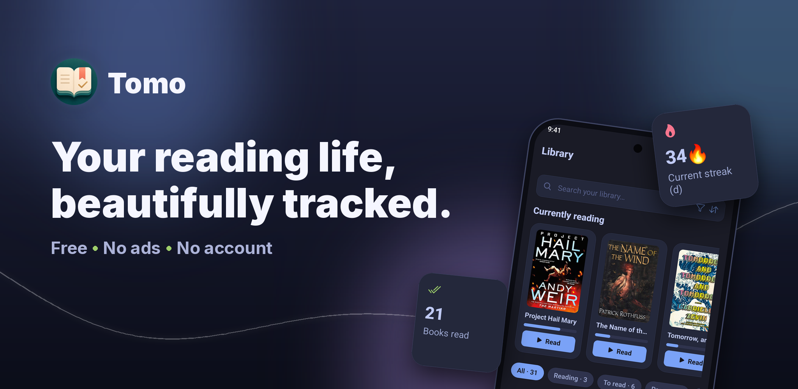
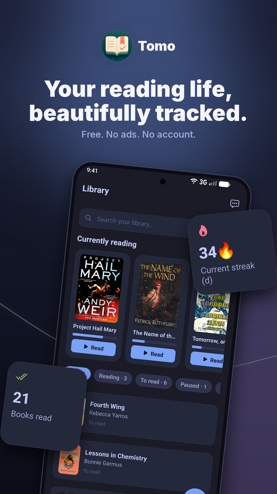
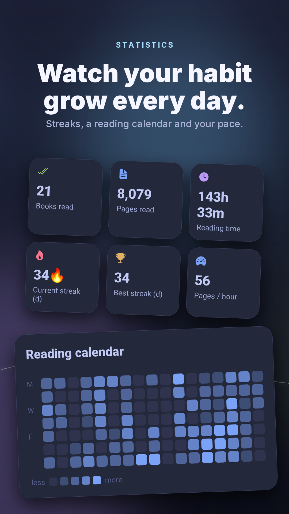
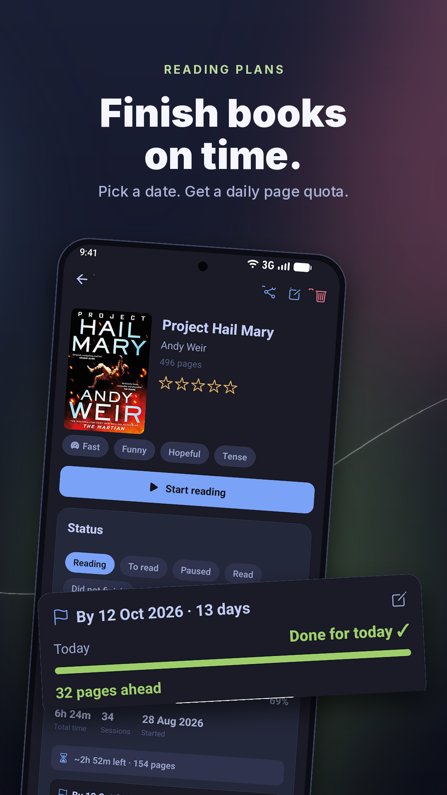
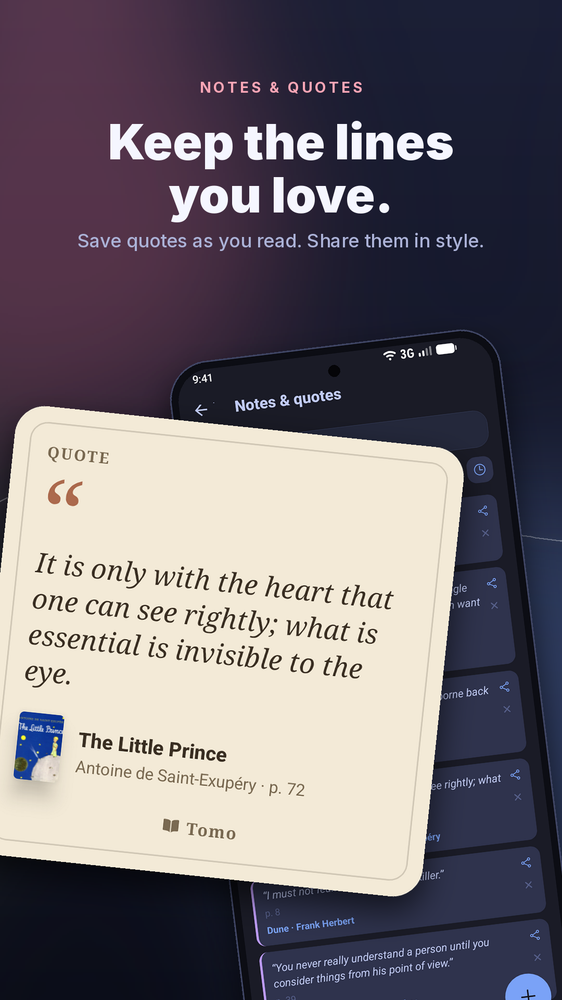
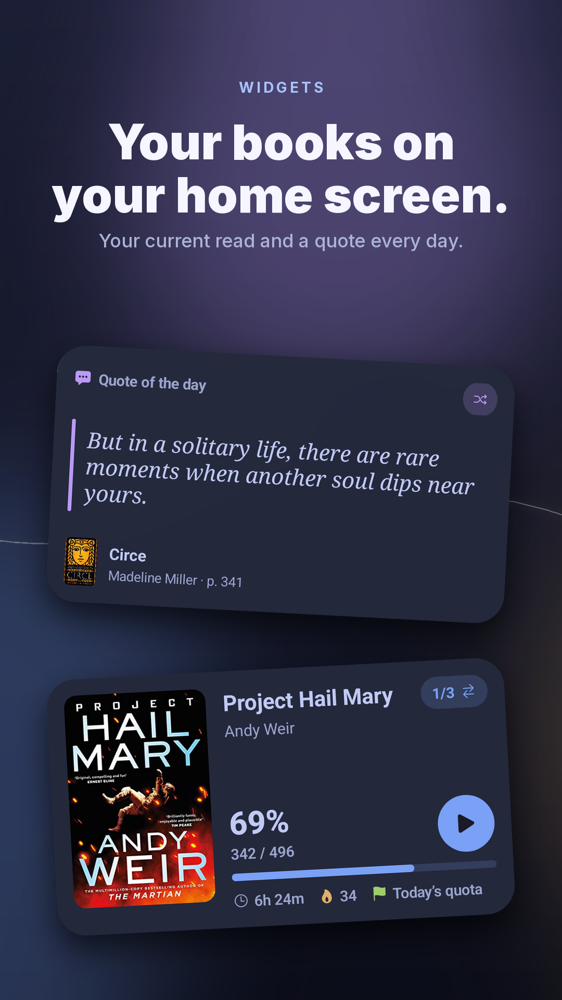
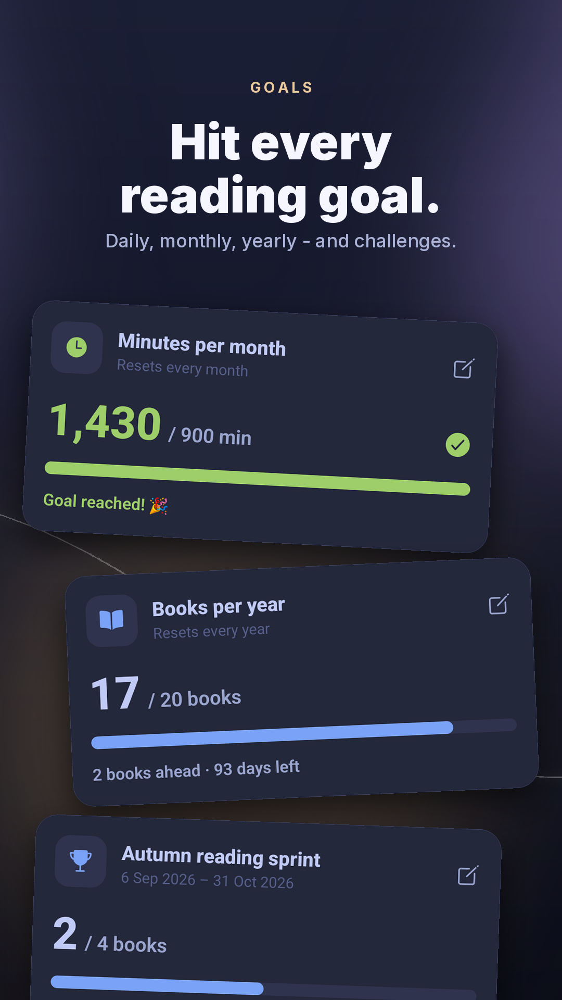
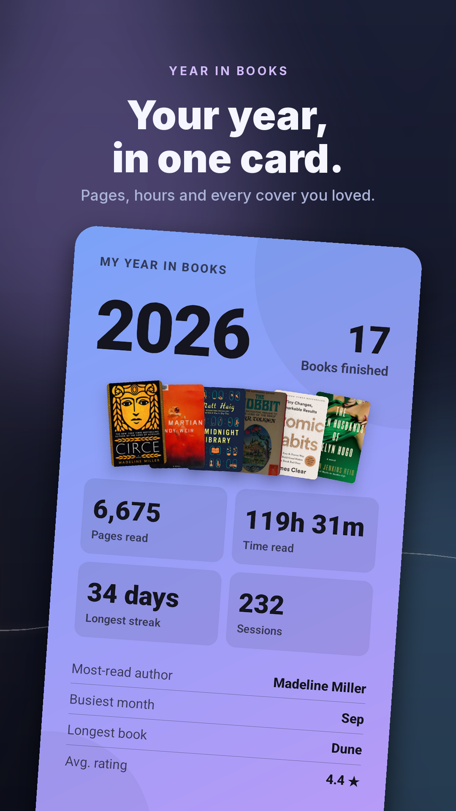
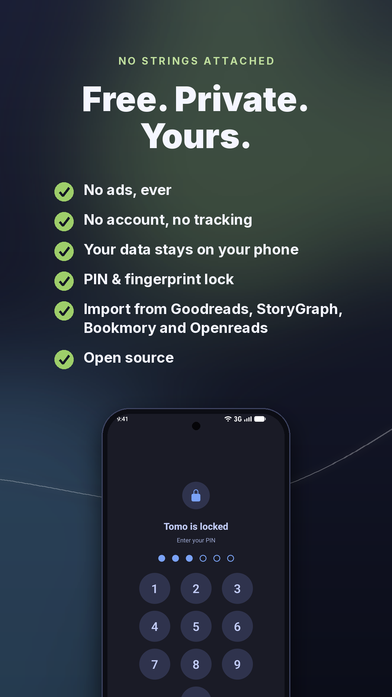

# Tomo

A free, local-first reading tracker for Android, and an open alternative to Bookmory. Keep a library, track reading sessions and progress, set goals, and look at your stats, with everything stored on your device.

It is built with Expo (React Native and TypeScript). Book data comes from Google Books and Open Library, with OPAC SBN (the Italian national library catalogue) filling in missing page counts, all free and without an API key.



## Screenshots

|  |  |  |  |
|---|---|---|---|
|  |  |  |  |

## Features

- Library organised by status (to read, reading, read, paused, did not finish), with custom coloured shelves.
- Add books by searching online (Google Books or Open Library), scanning an ISBN barcode, or entering them by hand with your own cover and an optional ISBN.
- Update a book from the catalogues by its ISBN, with a field-by-field preview: fields the book is missing are pre-selected, anything that would replace what you entered is opt-in. Books with an ISBN but no cover, page count or author are flagged, and one tap fills the empty fields for the whole library (also done automatically after a CSV import).
- A reading timer that records how long you read and which pages.
- Per-book progress and a remaining-time estimate, a reading curve, and a reading plan: pick a deadline and Tomo gives you each day's page quota and tells you whether you're ahead or behind.
- Statistics: reading time, pages, a day streak, a weekly chart, a GitHub-style heatmap, this year against last year to the same day, when you read (time of day and weekday), rating distribution, most-read authors, moods and pace, monthly insights, and a to-read pile forecast with its "tsundoku index", shareable as a card.
- Goals per day, month or year (pages or minutes; books per month or year) and challenges with a start and end date, each showing whether you're ahead of or behind schedule.
- A "year in books" summary with the covers of the year's books, shareable as an image in square or story format.
- Half-star ratings and a personal review per book.
- Notes and quotes with page numbers, searchable across the whole library, and quick to capture during a reading session (also from the session notification) without stopping the timer. A quote can be shared as an image, with its book and cover.
- A shareable "reading memory" card when you finish a book: dates, days, pages, time, rating, reading curve and a favourite quote.
- Series, mood, and pace fields shown as chips.
- Import from Bookmory (database or Excel export, with reads, timed sessions and notes), Openreads (backup or CSV), Goodreads and StoryGraph (CSV). Files can also be shared to Tomo straight from another app.
- Full JSON backups, by hand or automatically into a folder you pick (daily or weekly, keeping as many as you choose). Restoring can merge with what's on the phone, keeping the most recent copy of everything (deletions carry over too, and are listed before they're applied), or replace it.
- An optional reading reminder that can skip the days you've already read.
- App lock with a PIN and, optionally, fingerprint or face unlock. While locked, the app can be blanked in the recent-apps switcher, widgets and notifications can hide titles, quotes and progress, and links from widgets, notifications or other apps wait for the PIN. Wrong PINs are throttled, and changing the phone's clock doesn't get around it.
- Home-screen widgets: currently reading (with today's reading-plan quota, switching between the books you're reading), quick-start a session, streak and goal, reading calendar, and a quote of the day. All resizable, laid out for their actual size, and following the system light/dark mode.
- 16 light and dark colour themes, plus Material You (colours from your wallpaper) on Android 12 and later.
- Six languages: Italian, English, Spanish, French, German, Portuguese, following the system language by default.
- All data stays local: no account, no ads, no analytics, no tracking.

## Install

Tomo is distributed as an APK on the [Releases](https://github.com/Balzabu/tomo/releases) page. It is not on Google Play or F-Droid.

1. Open [Releases](https://github.com/Balzabu/tomo/releases) and download the latest `tomo-vX.Y.Z.apk`.
2. On your phone, allow installing from your browser or files app (Settings, Apps, Install unknown apps).
3. Open the APK to install. It needs Android 7.0 (API 24) or newer.

The APK is signed with the developer's release key, so later versions install over an existing copy.

## Why not Google Play or F-Droid?

I tried the Google Play route. I paid the one-time registration fee and completed the identity verification. The blocker is that Google now requires new personal developer accounts to run a closed test with at least 12 testers for 14 days in a row before the app can be submitted for production. Tomo is free, has no paid features of any kind, and collects nothing, so paying random people (on sites like Fiverr) just to clear an artificial testing quota made no sense to me. The app is not on Google Play.

F-Droid only accepts apps whose code and dependencies are free software. Tomo's ISBN barcode scanner is built on expo-camera, which on Android pulls in Google's proprietary `com.google.mlkit:barcode-scanning` and `com.google.android.gms:play-services-code-scanner`. Those libraries are used nowhere else in the app, only for reading ISBNs. Shipping on F-Droid would mean either dropping the scanner or maintaining a separate build flavour without it, and I would rather not keep two versions in sync, so Tomo is not on F-Droid either. The scanner is only a shortcut: you can still add any book by searching it online or entering it by hand.

For both reasons, Tomo is distributed straight from GitHub [Releases](https://github.com/Balzabu/tomo/releases).

## Tech stack

- Expo SDK 54, React Native 0.81, React 19, TypeScript.
- expo-router 6 for file-based navigation.
- Zustand for state, persisted to AsyncStorage. There is no backend.
- Google Books and Open Library REST APIs for book metadata, with no key required (an optional Google key is supported), and the OPAC SBN API for page counts the other two lack.
- expo-camera for ISBN barcode scanning.
- Custom chart and heatmap components built on react-native-svg, without a chart library.
- expo-image and expo-image-picker for covers.
- react-native-view-shot and expo-sharing to share books, quotes, reading memories, the to-read pile and the year in books as images.
- expo-notifications for the reading reminders and the ongoing reading-session notification.
- react-native-android-widget for the home-screen widgets.
- expo-local-authentication for the fingerprint/face app lock.
- fflate and expo-sqlite to read other apps' exports (zip archives, Excel files and Bookmory's SQLite database) on the device.
- A small local Expo module (`modules/tomo-system`, Kotlin) for Material You colours, hiding the app in Recents, receiving shared files, and a monotonic clock for the app lock.
- Expo config plugins in `plugins/` for what the managed config can't express: the share target, widget provider extras, and Android hardening (no cloud backup or device-to-device transfer, non-exported third-party activities, no replay of a stale launch intent).
- patch-package patches in `patches/` (react-native-android-widget: the widget image provider only serves the launcher, widget links stay inside Tomo, system fonts in widgets, and a cold-start fix so widgets don't stay blank).
- expo-localization with a small custom dictionary for the six languages.
- Gradle build, Hermes engine, New Architecture enabled.

## Development

You can run the app on your phone with Expo Go, without a native build:

```bash
npm install
npx expo start
```

Install Expo Go on Android, then scan the QR code shown in the terminal. The phone and the computer need to be on the same Wi-Fi; if the network blocks it, run `npx expo start --tunnel`.

Some features use native code that does not run inside Expo Go (widgets, notifications, Material You colours, the share target and the app lock's clock). Build an APK to test those.

Type-check with:

```bash
npm run typecheck   # or: npx tsc --noEmit
```

The pure modules have assertion scripts that run under plain Node 22.6+, without a device or a bundler: ISBN handling, page-count parsing, catalogue refresh diffing, CSV import and export, other apps' exports (with real fixtures in `scripts/check/fixtures`), read history, chunked storage, backup merge and deletions, goals, reading plans, statistics, reminders, the quote of the day, the app-lock throttle and HTML-to-text cleanup:

```bash
npm run check
```

## Build a release APK

A helper script builds signed Android artifacts on Linux or WSL:

```bash
./build-release.sh apk     # APK only
./build-release.sh aab     # AAB only
./build-release.sh         # both
```

The APK is written to `android/app/build/outputs/apk/release/app-release.apk`.

Signing reads `android/keystore.properties`, which is gitignored. When that file is missing, the release is built unsigned. See [RELEASING.md](./RELEASING.md) for the full flow.

Keep `android/app/*.keystore` and `android/keystore.properties` private; they are your signing key and passwords. Back them up offline. If you lose the key you cannot ship updates that install over an existing copy.

## Project structure

```
app/                     # screens (expo-router, file-based routing)
  _layout.tsx            # theme, data hydration, navigation stack
  (tabs)/                # Library, Statistics, Goals, Settings
  book/[id].tsx          # book detail
  timer/[bookId].tsx     # reading session
  search.tsx scan.tsx    # online search, ISBN scan
  add-manual.tsx         # manual entry
  wrapped.tsx            # year in books
  notes.tsx              # notes & quotes across the library
  +native-intent.tsx     # incoming links (held back while the app is locked)
  settings/              # settings sub-screens
src/
  types/                 # data model
  store/                 # Zustand stores, AsyncStorage persistence
  services/              # Google Books, Open Library, OPAC SBN; catalogue refresh
  lib/                   # storage, stats, goals, plans, backup/merge, imports, notifications, utils
  components/            # reusable UI (covers, charts, heatmap)
  theme/                 # colour schemes and spacing
  i18n/                  # translations (6 languages)
  widgets/               # home-screen widget rendering
modules/tomo-system/     # local native module (dynamic colours, Recents, share target, monotonic clock)
plugins/                 # Expo config plugins (share target, widgets, Android hardening)
patches/                 # patch-package patches for native dependencies
scripts/check/           # assertion scripts for the pure modules (npm run check)
scripts/screenshots/     # demo library and composer for the store/README screenshots
docs/                    # GitHub Pages site (privacy policy)
assets/   screenshots/   android/
```

All data is saved locally with AsyncStorage, split into per-collection chunks (see `src/lib/storageCore.ts`) so no single record can hit Android's 2MB row read limit. A save rewrites only the chunks that changed, which relies on one rule: store items are never mutated in place, always replaced with a new object.

## Contributing

Issues and pull requests are welcome. If you change UI text, keep the six language blocks in `src/i18n/strings.ts` in sync (every key must exist in all six), and run `npx tsc --noEmit` and `npm run check` before opening a PR. User-facing changes go in [CHANGELOG.md](./CHANGELOG.md).

## License

Tomo is released under the GNU General Public License v3.0 or later. See the [LICENSE](./LICENSE) file.

## Privacy

The full privacy policy is at [balzabu.github.io/tomo/privacy.html](https://balzabu.github.io/tomo/privacy.html) (source: [`docs/privacy.html`](./docs/privacy.html)).

Everything you create (books, sessions, notes, shelves, goals, custom covers) is stored only on your device, in the app's private storage. There is no account, no analytics, no ads, and no third-party tracking, and nothing is uploaded to a server. Tomo's data is excluded from Android's cloud backup and from device-to-device transfer: move it with a backup file.

The app makes network requests only to fetch public data from Google Books, Open Library and OPAC SBN (the Italian national library catalogue, asked only for page counts), plus, for covers imported from another app (Bookmory), the address that app stored: when you search for a book or look up an ISBN, when you update a book from the catalogues or fill in missing details (by hand, or automatically after a CSV import), when you verify an optional Google Books API key, and when it displays a cover that came from one of those catalogues (covers are stored as URLs and loaded on demand, also in the widgets; a cover you pick from your photos is stored on the device). Those requests contain only search terms, ISBNs or cover URLs, with no personal identifiers. The camera is used only to scan ISBN barcodes, which are read on the device and never uploaded.
